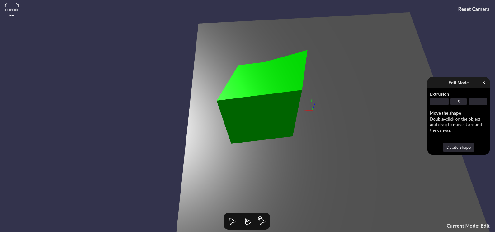
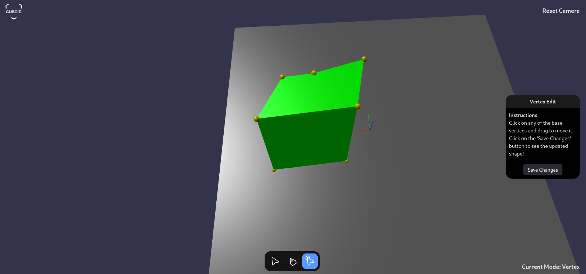
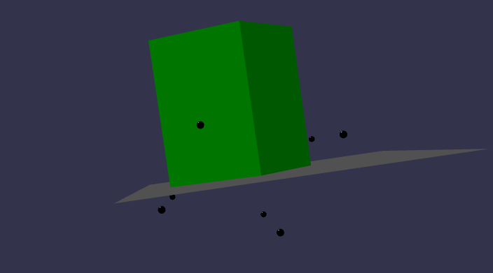
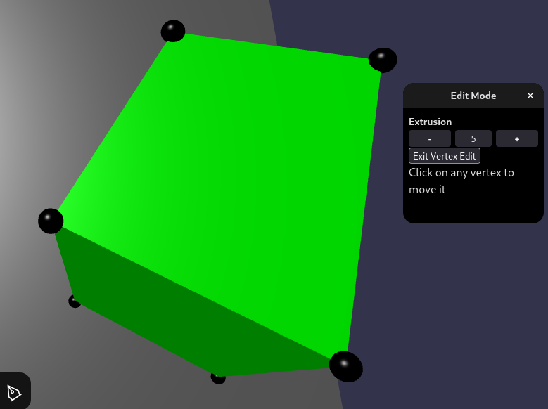
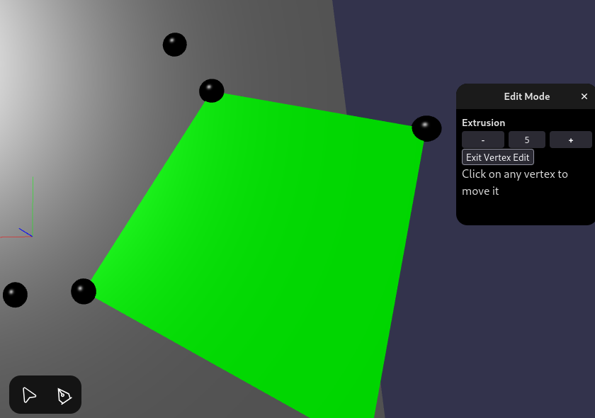

# Cuboid
A Vite + Babylon.js-based platform that allows you to draw 2D objects and convert them into 3D shapes.



# Table of Contents  

1. [How to Run This Project Locally](#how-to-run-this-project-locally)  
2. [How to Use the Application](#how-to-use-the-application)  
3. [Challenges](#challenges)  
4. [Future Implementation](#future-implementation)  

# How to Run This Project Locally

Before you begin, make sure **Node.js** is installed on your machine.

**Steps:**

1. Clone this repository
2. Navigate to the project directory and install dependencies:
    
    ```jsx
    npm install
    ```
    
3. Run the project
    
    ```jsx
    npm run dev
    ```
    

1. Open the browser and go to: `localhost:5173`

---

# How to Use the Application

## **Navigation:**

1. **Scroll** – Move vertically.
2. **Shift + Scroll** – Move horizontally.
3. **Control + Scroll** – Zoom in and out.
4. **Right Click + Drag** - To rotate the camera.

## **Modes:**

Modes can be selected from the **select bar** at the bottom.

### **Selector Mode:**

1. Used to move around the canvas and select objects.
2. An object can be selected by clicking on it, which automatically switches the mode to **Edit**.

### **Draw Mode:**

1. Users are given with a drawing canvas in XY plane where any 2D shape can be drawn.
2. Once the shape is closed, a button appears to convert the 2D shape into a 3D object. Clicking the button switches the mode to **Edit**, and a default extrusion height is applied.

### **Edit Mode:**

1. Users can adjust the height of the selected object using the dialog box that opens on the right side of the screen.
2. Users can click and move the 3D object on the **XY plane**.
3. Users can also delete the seleced shape in this mode.

### **Vertex Edit Mode:**
1. Click on the third option below the select bar to switch to **Vertex Edit Mode**. Then, click on the 3D shape to enable it.
2. In this mode, the user can select any of the vertices of the selected shape and move it around by dragging.
3. An instruction tab with a Save button is given on the right side of the screen.

### **Additional Features:**

- **Camera Reset Button:** Located at the top right. **Double-click** to reposition the camera.
- **Mode Indicator:** Located at the bottom right, it displays the current mode.

---

# My approach to the assignment

1. The task included multiple modes and variables, so I decided to use Vite, Babylon.js, and React. Since I was new to Babylon.js, I spent some time learning and understanding the framework. I learned how to create a scene in Babylon.js and explored different types of meshes [[https://doc.babylonjs.com/features/featuresDeepDive/mesh/creation/](https://doc.babylonjs.com/features/featuresDeepDive/mesh/creation/)].ChatGPT and DeepSeek were also really helpful in gaining a better understanding of this library and their functions.
2. I created a simple 3D scene, set up the camera, added a central 3D axis, and fixed the navigation to move around the canvas.
3. I created a global context to easily pass the operation mode (Selector, Draw, Editor, and Vertex Edit) across components. I also built the bottom navbar and added functionality to switch between different modes.
4. I developed the functionality to draw on a given surface, recognize closed surfaces, and convert them into polygons. I am gradually learning and implementing other features, such as adding default extrusion to objects, adjusting the height of 3D shapes, and improving navigation around the canvas.

I will clearly explain my approach in the following section.

---

# Challenges

1. **Drawing a 2D shape on a 3D scene:** I faced difficulties in drawing a closed 2D shape on the surface because the y-axis made it hard to accurately close the shape.
    
    **Solution:** Initially, I considered drawing the 2D shape in a separate section and then adding it to the canvas. However, the problem statement required drawing directly on the surface. To solve this, I forced the y-coordinates of the vertices to zero so that they remained on the surface.
    
2. **Enabling the “Extrusion” button after completing the 2D diagram:** It was challenging to determine the exact screen position near the shape where the button should pop up.
    
    **Solution:** I found the center of the 3D object using `mesh.getBoundingInfo()`, then converted the object's 3D coordinates in the canvas into 2D screen coordinates.
    
3. **Extruding a 2D polygon into a 3D shape:** This was the most challenging part of the task. I experimented with different methods such as `MeshBuilder.ExtrudeShape`, `MeshBuilder.ExtrudePolygon`, and `PolygonMeshBuilder`. I encountered multiple errors like `contour[0] is undefined` and `earcut not found` (even though I had installed and imported Earcut). Eventually, I managed to use `PolygonMeshBuilder` to extrude a rectangular plane along the Z-axis. However, I later realized that this method requires the 2D shape to be in the XY plane and extrudes it along the Z-axis, while my drawing surface was in the XZ plane. 😥
4. **Converting the drawing plane and other features from the XZ plane to the XY plane:** Rotating the ground, camera, and other elements was difficult, but through this, I gained a better understanding of the 3D scene.
5. **Encountering the "Earcut not found" error again:** I somehow managed to generate an extrusion of the 2D object using `ExtrudeShape`, but it was along the Y-axis. I then learned that `ExtrudeShape` takes a 2D shape in the XZ plane and extrudes it along the Y-axis. Instead of switching back to the XZ plane, I rotated the extruded 3D shape to align with the XY plane.
6. **Updating the extrusion height:** Adjusting the height from a button in another component was challenging, requiring a restructuring of the logic. To update the height, I had to create an entirely new 3D object with the new height. However, this caused lag and performance issues because a new 3D object was being created and replacing the old one with each operation.
7. **Vertex editing:** Using `mesh.getVerticesData()`, I obtained all the vertices and marked them with spheres. However, the orientation was incorrect because I had previously rotated the 3D object. I fixed this by rotating the vertices accordingly. I applied drag operations to the vertices using `PointerDragBehavior()`, but updating the shape dynamically remained a challenge.




---

# **Future Implementation**

1. Develop an alternative approach to updating the height of the 3D object without impacting performance.
2. Implement the vertex editing feature. It has some bug.
3. Enclose the selected object within a bounding box.
4. Complete the additional bonus tasks mentioned in the email.
5. Fix the **"Camera Reset"** button—currently, the user needs to click twice to reposition the camera.
6. Prevent the 3D object from moving beyond the drawing surface while dragging.
7. Refactor the code by organizing it into separate modules for better readability and maintainability.